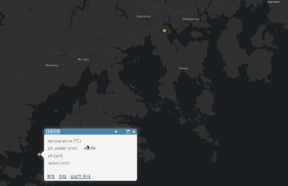

# ArcGIS Server

### ArcGIS REST Services Directory

1. ArcGIS Server URL 찾기

   - 별도의 URL이 존재하는 것이 아닌 실행 파일을 총해 서버를 만들어야 하는 듯

     - 윈도우 환경에서 설치 파일을 통해 서버 사이트를 만드는 것 같음

     - ssh에서 진행할 수 있는 방법 찾아야 할 듯

2. 만들어진 ArcGIS Server에 데이터 추가, 배포 어떻게 하는지 찾기

3. 데이터 형식은 어떻게 되는지 확인 필요

   - 다른 기관에서 만든 ArcGIS Server 사이트 참고해서 알아봐야할 듯

     - [참고 사이트 (기상청 KMA)](https://portal.esrikr.com/arcgis/rest/services)

4. [https://services6.arcgis.com/](https://services6.arcgis.com/)

   - 위의 사이트는 그냥 기본 템플릿인 듯

- ❗️ `Rest API`를 사용하는 방법으로는 데이터 형식이 `GeoJSON` 형식일 경우 먹힐 가능성도 존재

  - ArcGIS -> 콘텐츠 -> 새 항목 -> URL -> GeoJSON 형식의 API 주소 입력 -> 레이어 유형 선택 (GeoJSON)

    - 아직 테스트 X

### GeoJSON

> [기본적인 GeoJSON 형식의 데이터 위키피디아](https://en.wikipedia.org/wiki/GeoJSON#TopoJSON_Schema)

```JavaScript
{
  "type": "FeatureCollection",
  "features": [
    {
      "type": "Feature",
      "geometry": {
        "type": "Point",
        // Point || LineString || Polygon
        "coordinates": [127.02432250976562, 34.4443130493164]
        // Polygon의 경우 3개 이상의 좌표 필요 (무조건 닫힌 형태의 좌표 데이터가 필요)
        // [
        //   [35.0, 10.0],
        //   [45.0, 45.0],
        //   [15.0, 40.0],
        //   [10.0, 20.0],
        //   [35.0, 10.0]
        // ]
        // 4각형의 polygon 생성
      },
      "properties": {
        "temperature": 15.547189712524414,
        "unit": "°C"
      }
    },
    // 다른 데이터 추가 시, 아래와 같이 추가 가능
    {
      "type": "Feature",
      "geometry": {
        "type": "Point",
        "coordinates": [127.57968902587891, 34.8977394104004]
      },
      "properties": {
        "temperature": 10.547189712524414,
        "unit": "°C"
      }
    }
  ]
}
```

- 하드코딩으로 GeoJSON 데이터 추가한 결과

  > [`📂 ph_data.json`](./ph/ph_data.json)
  >
  > [`📂 oxygen_data.json`](./oxygen/oxygen_data.json)
  >
  > [`📂 conductivity_data.json`](./conductivity/conductivity.json)

  
